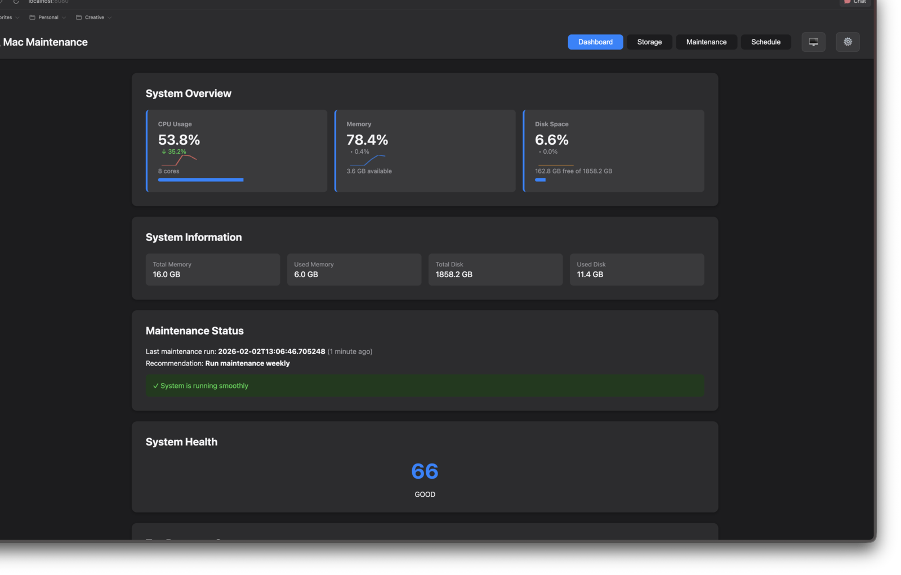
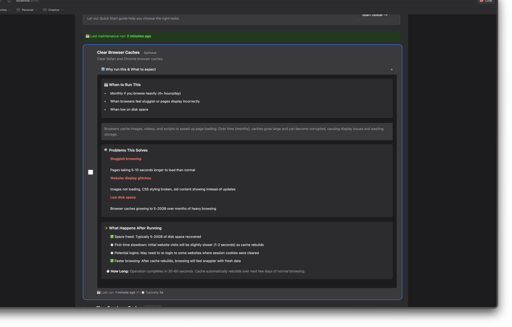
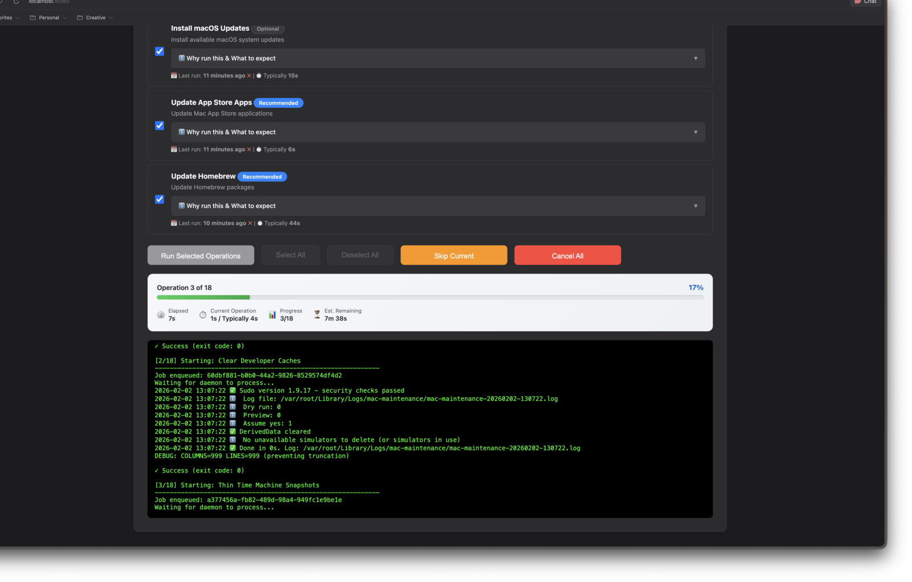
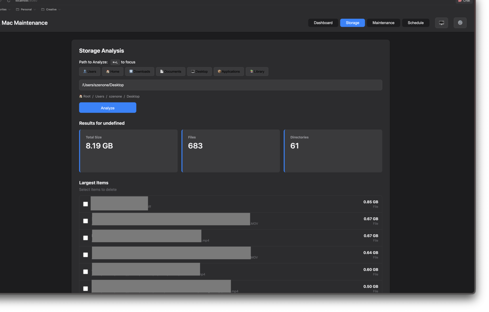

# 🧹 macOS Maintenance Toolkit

**Your Mac's Personal Health Coach** – Keep your macOS system running smoothly without the snake oil.

[](https://www.apple.com/macos/)
[](https://www.python.org/)
[](LICENSE)
[](tests/)

---

## 🎯 What Is This?

Think of this as a **tune-up for your Mac** – but smart about it. Unlike those "optimizer" apps that promise to make your Mac run like new by deleting everything in sight, this toolkit takes a measured, informed approach.

**The Philosophy:**
- 🩺 **Diagnose before you prescribe** – See what's actually wrong first
- 🛡️ **Safe by default** – Nothing destructive happens without your explicit permission
- 🎓 **Educate, don't obfuscate** – Understand what's happening and why
- 🚫 **No snake oil** – Modern macOS is pretty good at maintaining itself; we focus on what actually matters

**Perfect For:**
- 💼 Professionals who want their Mac to "just work"
- 🔧 Power users who like to understand what's happening under the hood
- 👨‍💻 Developers maintaining multiple Macs
- 🏢 IT admins managing fleets of macOS devices
- 🤔 Anyone who's ever wondered "should I really be running CleanMyMac every week?"

---

## ✨ What Makes This Different?

### Traditional "Optimizer" Apps Do This:
```
🚨 DANGER! Your Mac is 97% dirty!
💥 Click here to clean 47 GB of "junk"!
✨ Speed up your Mac by 300%!*

*Results not guaranteed, may slow down your Mac temporarily,
 could break things, definitely wants your credit card.
```

### This Toolkit Does This:
```
📊 Your Mac is healthy (score: 87/100)

Disk: 92% used (low on space - worth investigating)
Security: ✓ SIP enabled, ✓ FileVault on
Updates: 2 macOS updates available
Homebrew: 12 packages outdated

Want to:
  • See what's using all that disk space? (Storage analyzer)
  • Update your software? (Safe, guided process)
  • Get a detailed health report? (No scary warnings)
```

**The Difference:** We show you the data, explain what it means, and let *you* decide what to do. No scare tactics, no mysterious "optimization," no subscription fees.

---

## 🚀 Quick Start

### Option 1: The Easy Button (Visual Interface)

If you prefer clicking buttons to typing commands:

```bash
# 1. Download and make executable
chmod +x maintain.sh

# 2. Launch the interactive interface
./maintain.sh --tui
```

You'll get a beautiful terminal dashboard with:
- 📊 System health at a glance
- 💾 Visual storage analyzer (see what's eating your disk space)
- 🔧 One-click maintenance operations
- ⌨️ Keyboard shortcuts (because mice are for quitters)

### Option 2: Quick Status Check (One Command)

Want to know if your Mac is okay right now?

```bash
./maintain.sh --status
```

This gives you a health dashboard in seconds. No changes, just information.

### Option 3: Web Interface (Recommended)

A modern web-based dashboard for visual maintenance:

```bash
# Launch the web interface
./run-web.sh
```

Then open **http://localhost:8080** in your browser.

### Option 4: The "I'm Feeling Lucky" Button

Run safe maintenance operations that almost everyone should do regularly:

```bash
./maintain.sh --all-safe
```

This will:
- ✅ Check your disk health
- ✅ See if updates are available
- ✅ Verify system security settings
- ✅ Generate a report you can actually understand
- ❌ Won't delete anything without asking
- ❌ Won't rebuild indexes or caches (unless things are actually broken)

---

## 📸 Screenshots

### Dashboard
Real-time system overview with CPU, memory, disk usage, and health score.



### Maintenance Operations
Each operation explains **why** you'd run it and **what to expect** — no guesswork.



### Progress Tracking
Live output, elapsed time, estimated remaining, and the ability to skip or cancel.



### Storage Analysis
See exactly what's eating your disk space.



---

## 💡 Core Features

### 1. 🌐 Web Dashboard (Recommended)

A modern, visual interface for Mac maintenance:

- **System Overview**: CPU, memory, disk usage at a glance
- **18 Maintenance Operations**: Each with clear "Why & What to expect" guidance
- **Progress Tracking**: Live output, elapsed time, ETA, skip/cancel controls
- **Storage Analysis**: Visual breakdown of what's using your disk
- **Scheduling**: Set up automated maintenance routines
- **Doctor/Preflight**: Checks for missing dependencies before you run

**Launch it:** `./run-web.sh` → Open **http://localhost:8080**

### 2. 📊 Interactive Dashboard (TUI)

A beautiful terminal interface for keyboard enthusiasts:

- **Real-time monitoring**: Disk usage, memory, CPU, security status
- **Storage analyzer**: See exactly what's using your disk space (categorized by images, videos, documents, code, etc.)
- **One-click operations**: Run maintenance tasks with visual feedback
- **Keyboard-driven**: Navigate like a pro with intuitive shortcuts

**Launch it:** `./maintain.sh --tui`

### 2. 🔍 Smart Storage Analysis

Ever wondered where all your disk space went?

```bash
mac-maintenance analyze ~/Documents
```

**What you'll see:**
- Total size breakdown
- Categorized files (images: 25 GB, videos: 142 GB, etc.)
- Top 15 largest files and directories
- Visual bar charts
- Option to export as JSON for automation

**The Smart Part:** It knows what file types actually matter and shows you patterns, not just raw file lists.

### 3. 🩺 System Health Checks

Get a **real** assessment of your Mac's health:

```bash
./maintain.sh --status
```

**Checks:**
- 💾 Disk space and usage patterns
- 🔐 Security status (SIP, FileVault, Gatekeeper, Firewall)
- 📦 Software updates available
- ⏰ Time Machine snapshot count
- 🔧 Homebrew installation health
- 📊 Overall health score (0-100)

**What Makes It Smart:** Contextual warnings only when things actually matter. 75% disk usage? That's worth mentioning. 45%? You're fine.

### 4. 🛡️ Safe Maintenance Operations

All the maintenance tasks you'd want, with guardrails:

**Updates:**
- List/install macOS updates
- Update Homebrew packages
- Update Mac App Store apps

**Disk Operations:**
- Verify disk integrity
- SMART status checks
- Repair volumes (when needed)

**Cleanup (age-based, not destructive):**
- Trim old log files (30+ days old)
- Clean old caches (30+ days old)
- Thin Time Machine snapshots (when space is low)

**System Maintenance:**
- Run macOS periodic scripts
- Flush DNS cache
- Rebuild Spotlight index (only when needed)

**Safety Features:**
- 🔒 Preview mode: See what would be deleted before deleting
- 🚨 File count limits: Warns if >10,000 files would be affected
- ✋ Confirmation prompts: No surprises
- 📝 Detailed logging: Every action recorded

### 5. 🤖 Automation-Friendly

Perfect for scheduled maintenance or remote systems:

```bash
# Silent mode (for cron jobs)
./maintain.sh --all-safe --quiet

# Machine-readable output
./maintain.sh --all-safe --output-json

# See what would happen without doing it
./maintain.sh --all-deep --dry-run
```

---

## 📦 Installation

### Prerequisites

**Required:**
- macOS Sequoia, Sonoma, or Ventura (might work on older versions)
- Admin password (for system operations)
- Terminal app with Full Disk Access permission

**Optional (for interactive TUI and storage analyzer):**
- Python 3.10 or newer
- 5 minutes for setup

### Step 1: Get the Script

```bash
# Clone the repository
git clone https://github.com/zenone/mac-maintenance.git
cd mac-maintenance

# Make it executable
chmod +x maintain.sh
```

### Step 2: Grant Permissions

The script needs "Full Disk Access" to read log files and cache directories.

**How to grant it:**
1. Open **System Settings** → **Privacy & Security** → **Full Disk Access**
2. Click the **+** button
3. Navigate to `/Applications/Utilities/` and select **Terminal.app** (or your terminal app)
4. Toggle the switch to **ON**
5. Restart your terminal

**Why this is safe:** This lets the script *read* your logs and caches to analyze them. It doesn't give access to your personal files (photos, messages, etc.) and can't make changes without your permission.

### Step 3 (Optional): Enable Python Features

Want the interactive TUI and enhanced storage analyzer? Install Python components.

#### Recommended: `uv`

```bash
# Install uv (modern Python package manager)
curl -LsSf https://astral.sh/uv/install.sh | sh

# Create isolated environment
uv venv

# Activate it
source .venv/bin/activate

# Install the toolkit
uv pip install -e .

# Test it
mac-maintenance --version
mac-maintenance tui
```

#### Fallback: stdlib `venv` + `pip`

```bash
python3 -m venv .venv
source .venv/bin/activate
python -m pip install -U pip
python -m pip install -e .

mac-maintenance --version
mac-maintenance tui
```

**What if I skip this?** The bash script works perfectly fine standalone. You just won't get the fancy TUI or color-coded storage reports. Everything else works.

---

## 📖 Usage Guide

### For Beginners: Start Here

**1. Check if everything is okay:**
```bash
./maintain.sh --status
```

**2. If you see issues, launch the interactive interface:**
```bash
./maintain.sh --tui
```
Navigate with keyboard (press `?` for help), click around, see what's what.

**3. Run safe maintenance when you're ready:**
```bash
./maintain.sh --all-safe
```

**That's it.** You don't need to run this every day. Once a week or when something feels off is plenty.

### For Intermediate Users: Common Tasks

**See what's using disk space:**
```bash
mac-maintenance analyze ~/
```

**Update everything safely:**
```bash
./maintain.sh --install-macos-updates --brew --mas
```

**Clean up old files (preview first):**
```bash
./maintain.sh --preview --trim-logs 30
./maintain.sh --preview --trim-caches 30
# Looks good? Run for real:
./maintain.sh --trim-logs 30 --trim-caches 30
```

**Check if disk is healthy:**
```bash
./maintain.sh --verify-disk --smart
```

### For Advanced Users: Power Features

**Automated weekly maintenance (cron job):**
```bash
0 3 * * 0 /path/to/maintain.sh --all-safe --assume-yes --quiet
```

**CI/CD health check with JSON output:**
```bash
./maintain.sh --status --output-json | jq '.summary.health_score'
```

**Deep clean when something's actually wrong:**
```bash
./maintain.sh --all-deep
```
(includes snapshot thinning, cache cleaning, index rebuilding – use sparingly)

**Combine operations:**
```bash
./maintain.sh --verify-disk --space-report --security-audit --trim-logs 30
```

### TUI Keyboard Shortcuts

Once you launch `mac-maintenance tui`:

- `d` – Dashboard view
- `m` – Maintenance operations
- `s` – Storage analyzer
- `a` – About / help
- `r` – Refresh current view
- `?` – Show help
- `q` – Quit

**Mouse works too** – click tabs, buttons, checkboxes.

---

## 🤔 FAQ

### "Do I really need this? Doesn't macOS handle its own maintenance?"

**Short answer:** Modern macOS is pretty good at self-maintenance. You probably don't need to run maintenance tools constantly.

**When this is useful:**
- Your Mac feels sluggish and you want to diagnose why
- You're low on disk space and want to see what's using it
- You want to verify system health before a big project
- You manage multiple Macs and want consistent maintenance
- You're curious about your system's health

**When you don't need it:**
- Your Mac runs fine
- You have plenty of free space
- Nothing seems broken

**Bottom line:** Use this as a diagnostic and maintenance tool when needed, not a daily ritual.

### "Is this safe? Will it break my Mac?"

**Safety features:**
- ✅ Nothing destructive happens by default
- ✅ Every risky operation asks for confirmation
- ✅ Preview mode lets you see what would happen
- ✅ File count limits prevent accidental mass deletions
- ✅ Dry-run mode for testing
- ✅ All actions logged to `~/Library/Logs/`
- ✅ Script refuses to run as root (only uses sudo when necessary)
- ✅ Validates input parameters
- ✅ 245 automated tests ensure it works correctly

**What it won't do:**
- ❌ Delete files you're actively using
- ❌ Disable security features
- ❌ Modify system files recklessly
- ❌ Install anything without your permission

### "How often should I run this?"

**Recommended schedule:**
- **Weekly:** Quick status check (`./maintain.sh --status`)
- **Monthly:** Safe maintenance (`./maintain.sh --all-safe`)
- **When something feels off:** Deep maintenance (`./maintain.sh --all-deep`)
- **Never just because:** Don't run maintenance as a ritual

### "What's the difference between --all-safe and --all-deep?"

**`--all-safe`** (recommended for regular use):
- Health checks and reporting
- Disk verification
- List available updates
- Light log trimming
- **Zero destructive actions**

**`--all-deep`** (only when something's actually wrong):
- Everything in `--all-safe` PLUS:
- Time Machine snapshot thinning
- Cache cleanup (age-based, 30+ days)
- Periodic maintenance scripts
- DNS cache flush
- **Spotlight reindex (heavy operation)**

**Rule of thumb:** Use `--all-safe` regularly, `--all-deep` rarely.

### "Do I need Python installed?"

**No.** The core bash script works standalone and includes all essential maintenance features.

**Python is optional** and adds:
- 🎨 Interactive TUI with visual interface
- 📊 Enhanced storage analysis with categorization
- 🎯 Better visualizations and progress indicators

If you're comfortable with the command line, you don't need Python. If you want pretty interfaces, install Python.

### "Can I use this on macOS Ventura / Sonoma / older versions?"

Developed and tested on macOS Sequoia. Should work fine on Ventura and Sonoma.

Older versions (Monterey, Big Sur, Catalina) might work but are untested. Some features may behave differently.

### "What's the difference between this and CleanMyMac / OnyX / etc.?"

**CleanMyMac:**
- ➕ Pretty GUI, easy to use
- ➖ Subscription cost ($40/year)
- ➖ Aggressive deletion defaults
- ➖ Marketing encourages unnecessary "optimization"

**OnyX:**
- ➕ Free, powerful, trusted
- ➕ Lots of options
- ➖ Complex interface (easy to enable things you don't understand)
- ➖ Some operations are unnecessarily heavy

**This Toolkit:**
- ➕ Free and open source
- ➕ Safe defaults (nothing scary happens by default)
- ➕ Educational (explains what everything does)
- ➕ Automation-friendly (scriptable, JSON output)
- ➖ Requires terminal comfort (or Python for TUI)
- ➖ Less hand-holding for beginners (but we're working on it!)

### "I'm getting a permissions error. What do I do?"

**Most common issue:** Terminal doesn't have Full Disk Access.

**Fix:**
1. System Settings → Privacy & Security → Full Disk Access
2. Add Terminal.app (or iTerm2, etc.)
3. Restart terminal
4. Try again

**Still not working?**
```bash
# Check if you have permission to read logs
ls ~/Library/Logs

# If that fails, Full Disk Access isn't granted correctly
```

### "Can I run this in a cron job or automation?"

**Absolutely.** Designed for it:

```bash
# Silent mode (only errors shown, everything still logged)
./maintain.sh --all-safe --quiet

# Non-interactive (auto-confirm prompts with safe defaults)
./maintain.sh --all-safe --assume-yes

# Machine-readable output
./maintain.sh --all-safe --output-json
```

**Cron job example** (weekly Sunday at 3 AM):
```cron
0 3 * * 0 /path/to/mac-maintenance/maintain.sh --all-safe --assume-yes --quiet
```

### "I found a bug / have a feature request. Where do I report it?"

Open an issue on GitHub: [https://github.com/zenone/mac-maintenance/issues](https://github.com/zenone/mac-maintenance/issues)

**When reporting bugs, please include:**
- macOS version (`sw_vers`)
- Script version (`./maintain.sh --version`)
- Full command you ran
- Log file from `~/Library/Logs/mac-maintenance-*.log`

---

## 🏗️ Architecture

### The Stack

**Bash Script (maintain.sh):**
- Core maintenance operations
- System checks and reporting
- Works standalone, no dependencies
- 1,350 lines of careful bash scripting

**Python Package (optional):**
- Interactive TUI (powered by [Textual](https://textual.textualize.io/))
- Enhanced storage analyzer
- Rich terminal output
- Tested with 245 automated tests

**Bridge:**
- Seamless integration between bash and Python
- Graceful fallback when Python unavailable
- Zero dependencies on Python for core functionality

### Testing

- ✅ 245 automated tests (100% passing)
- ✅ Integration tests (bash + Python)
- ✅ Safety tests (file count limits, input validation)
- ✅ Platform tests (Apple Silicon + Intel)
- ✅ Manual testing on multiple macOS versions

---

## 🛠️ Development

### Running Tests

```bash
# Python tests
source .venv/bin/activate
pytest tests/ -v

# Quick test
pytest tests/ -q

# TypeScript type checking
npm run type-check
```

### Web Frontend Development

The web interface uses **TypeScript** compiled with **ESBuild** for type safety and fast builds.

**Development workflow:**

```bash
# Install Node.js dependencies (one-time)
npm install

# Option 1: Auto-rebuild on file changes (recommended)
npm run watch:web    # Terminal 1: Watch mode
./run-web.sh         # Terminal 2: Start server

# Option 2: Single build + server start
./run-web.sh         # Builds automatically before starting

# Type checking (zero errors required)
npm run type-check

# Production build
npm run build:web
```

**File structure:**

```
src/mac_maintenance/web/static/
├── ts/                      # TypeScript source
│   ├── app.ts              # Entry point
│   ├── types.ts            # Type definitions
│   └── modules/
│       ├── dashboard.ts    # System metrics
│       ├── maintenance.ts  # Operations
│       ├── storage.ts      # Storage analysis
│       ├── schedule.ts     # Scheduling
│       ├── ui.ts           # Theme, toast, modals
│       └── utils.ts        # Utilities
├── app.js                  # ESBuild output (45KB minified)
└── index.html              # HTML template
```

**See [WEB_DEVELOPMENT.md](WEB_DEVELOPMENT.md) for detailed frontend development guide.**

### Project Structure

```
mac-maintenance/
├── maintain.sh              # Main bash script
├── pyproject.toml           # Python package configuration
├── package.json             # Node.js dependencies (web frontend)
├── tsconfig.json            # TypeScript configuration
├── src/
│   └── mac_maintenance/
│       ├── cli/             # Command-line interface
│       ├── core/            # System information gathering
│       ├── storage/         # Disk usage analyzer
│       ├── tui/             # Interactive terminal UI
│       └── web/
│           ├── api/         # FastAPI REST endpoints
│           ├── static/      # Web frontend (TypeScript)
│           └── server.py    # Web server (uvicorn)
├── scripts/
│   ├── build-web.sh         # Build TypeScript frontend
│   └── watch-web.sh         # Watch mode for development
├── tests/                   # Python test suite
└── types/                   # TypeScript API type definitions
```

---

## 📜 License

MIT License – see [LICENSE](LICENSE) file for details.

**TL;DR:** Use it, modify it, share it. Just don't blame us if something goes wrong (though we've done our best to prevent that).

---

## 🙏 Credits

**Built with:**
- [Textual](https://textual.textualize.io/) – Amazing Python TUI framework
- [Rich](https://rich.readthedocs.io/) – Beautiful terminal formatting
- [Click](https://click.palletsprojects.com/) – CLI framework
- [psutil](https://psutil.readthedocs.io/) – System monitoring

**Philosophy inspired by:**
- macOS's own maintenance philosophy (let the system do its job)
- The [OnyX](https://www.titanium-software.fr/en/onyx.html) approach (power with safety)
- Years of "why is my Mac slow?" support requests

---

## 🚦 Status & Roadmap

**Current Version:** 3.0.0

**Recent Updates:**
- ✅ Interactive TUI with Dashboard, Storage, Maintenance views
- ✅ Enhanced storage analyzer with file categorization
- ✅ Preview mode for cleanup operations
- ✅ File count safety limits
- ✅ JSON output for automation
- ✅ 245 automated tests

**Coming Soon:**
- 📊 Historical trend tracking
- 🔔 Scheduled maintenance notifications
- 📱 Status bar widget (maybe)
- 🌐 Web dashboard (considering)

---

## 💬 Final Thoughts

**This tool exists because:**

Modern Macs don't need constant "optimization." They need **informed maintenance** when something's actually wrong.

**Use this toolkit when:**
- You want to understand your Mac's health
- Something feels off and you want to diagnose it
- You need to free up space and want to know where it went
- You want to keep software updated safely

**Don't use it:**
- As a daily ritual
- To chase that last 0.3% of performance
- Because some app told you your Mac is "infected with junk"

**Remember:** Your Mac is a tool. This toolkit helps you maintain it. But the best maintenance is usually letting macOS do its thing and only intervening when there's a real reason.

---

**Stay informed. Stay intentional. Keep your Mac healthy.**

🍎✨

---

**Repository:** [https://github.com/zenone/mac-maintenance](https://github.com/zenone/mac-maintenance)

**Issues/Suggestions:** [https://github.com/zenone/mac-maintenance/issues](https://github.com/zenone/mac-maintenance/issues)
